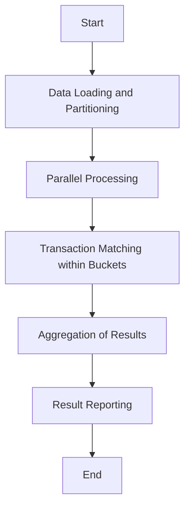
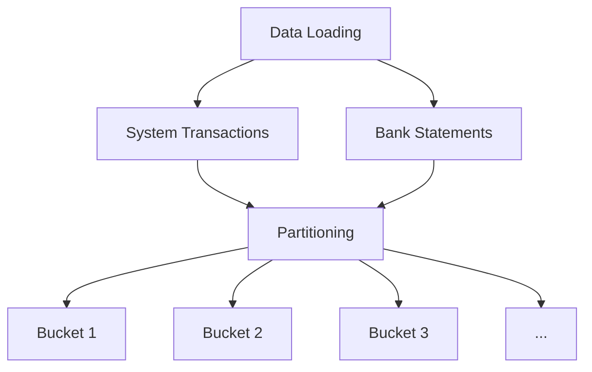
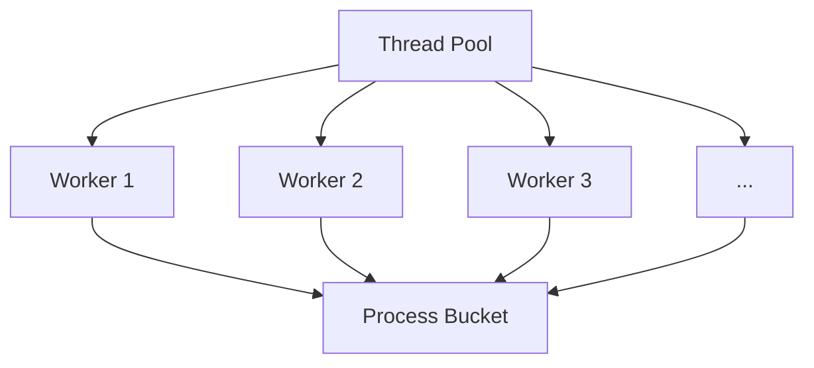
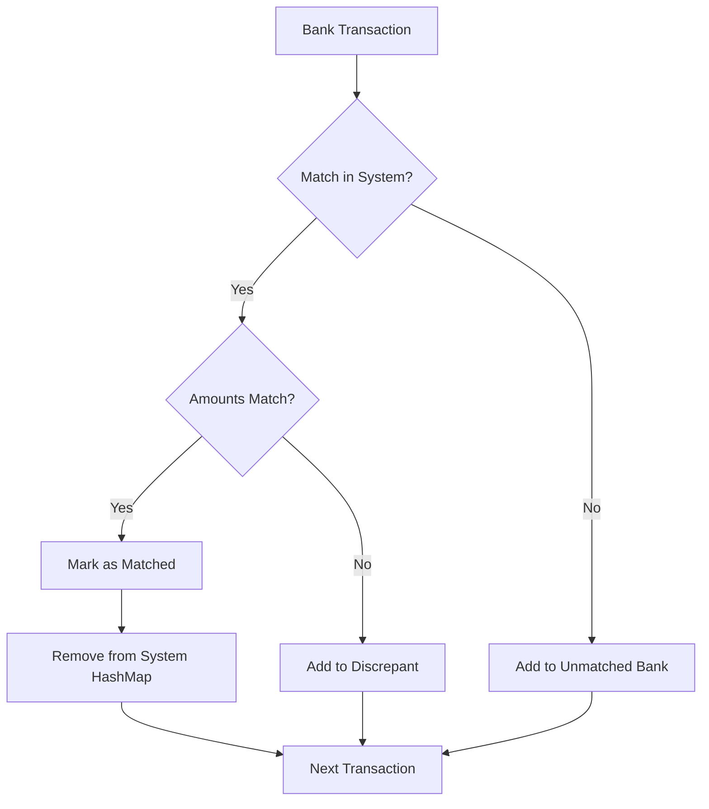
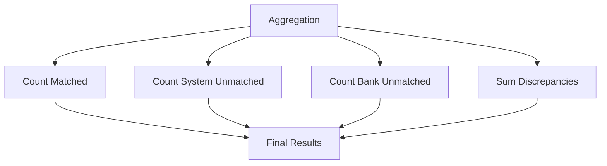
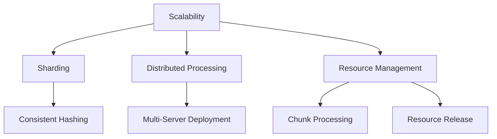
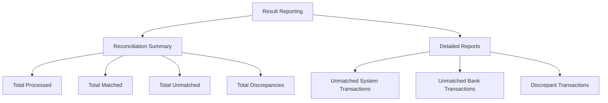

# Reconciliation Service Algorithm

## Algorithm Overview

## Detailed Process

### 1. Data Loading and Partitioning

#### System Transactions (First Dataset)
- **Partitioning**: Split the dataset into multiple buckets based on a consistent hashing function applied to the transaction IDs or dates.
- **Storage**: For each bucket, store transactions in an in-memory data structure like a HashMap for O(1) lookup.
- **Scalability**: Distribute buckets across multiple processes or servers if necessary.

#### Bank Statements (Second Dataset)
- **Partitioning**: Apply the same hashing function to ensure that corresponding transactions from both datasets end up in the same bucket.
- **Streaming**: Read and process bank transactions line by line to minimize memory usage.

### 2. Parallel Processing
- **Thread Pool**: Utilize a pool of worker threads to process buckets in parallel.
- **Concurrency**: Ensure thread-safe operations when accessing shared resources or aggregating results.

### 3. Transaction Matching within Buckets

#### Lookup and Matching
For each bank transaction in a bucket:
1. **Lookup**: Check if a matching system transaction exists in the bucket's HashMap.
2. **Match Found**:
   - **Amount Comparison**: Compare the transaction amounts.
   - **Exact Match**: Mark both transactions as matched.
   - **Discrepancy Detected**: Add to the 'discrepant' bucket for further analysis.
   - **Flagging**: Remove or mark the matched system transaction to prevent duplicate matching.
3. **No Match**:
   - **Unmatched Bank Transaction**: Add to the 'not found' bucket for bank transactions.

After processing all bank transactions in a bucket:
- **Unmatched System Transactions**: Remaining transactions in the HashMap are unmatched system transactions.

### 4. Aggregation of Results

#### Matched Transactions
- Count the total number of matched transactions across all buckets.

#### Unmatched Transactions
- **System Unmatched**: Transactions present in the system but missing in bank statements.
- **Bank Unmatched**: Transactions present in bank statements but missing in the system.

#### Discrepancies
- Calculate the sum of absolute differences in amounts for discrepant transactions.

### 5. Scalability Enhancements

#### Sharding
- Use consistent hashing to distribute data evenly and ensure that related data ends up in the same shard or bucket.

#### Distributed Processing
- Deploy the system across multiple servers or use a distributed computing framework to handle large volumes of data.

#### Resource Management
- Optimize memory usage by processing data in chunks and releasing resources promptly after use.

### 6. Result Reporting

#### Reconciliation Summary
- Total transactions processed
- Total matched transactions
- Total unmatched transactions
- Total discrepancies

#### Detailed Reports
- Lists of unmatched system transactions
- Lists of unmatched bank transactions, grouped by bank if applicable
- Lists of discrepant transactions with details

